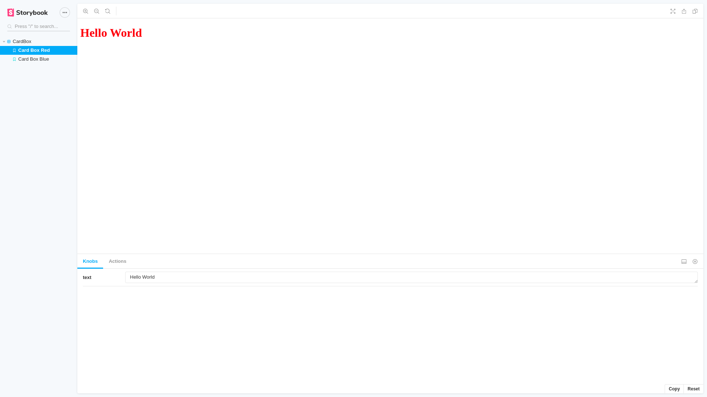
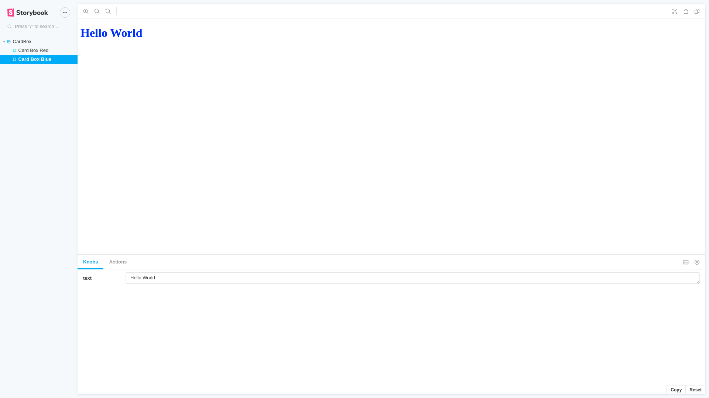

# storybook-hands-on
## Examples:
```javascript
export const CardBoxRed = () => ({
    components: {CardBox},
    template: "<card-box style='color: red' :msg='msg'/>",
    props: {
        msg: {
          default: text('text','Hello World')
        },
    }
})
```


```javascript
export const CardBoxBlue = () => ({
    components: {CardBox},
    template: "<card-box style='color: blue' :msg='msg'/>",
    props: {
        msg: {
          default: text('text','Hello World')
        },
    }
})
```



## Project setup
```
yarn install
```

### Compiles and hot-reloads for development
```
yarn serve
```

### Compiles and minifies for production
```
yarn build
```